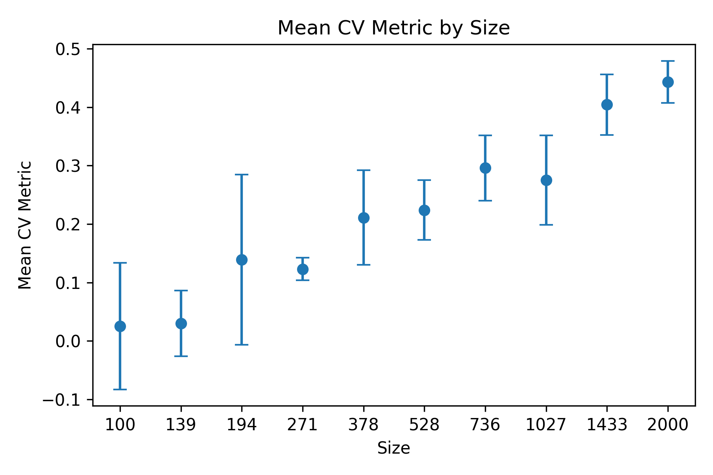

<p align="center">
  <i>A pipeline for simulating brain imaging data and associated phenotypes for power calculations.</i>
  <br/>
</p>


A brain imaging power calculator developed by the Masonic Institute of the Developing Brain at the University of Minnesota. The pipeline is built using [Python](https://www.python.org/) and [bash](https://www.gnu.org/software/bash/), and is designed to run on HPC clusters with a SLURM scheduler.

---

## Overview

This pipeline estimates statistical power for brain imaging studies by asking: *given a dataset of a certain size, how well can functional connectivity predict a phenotype of interest?* It does this by:

1. **Generating a sample-size grid** — a logarithmically spaced set of 10 sample sizes from N=100 to N=2000, with each size representing the number of simulated individuals' brain images
2. **Simulating functional connectivity** — for each index, a covariance matrix is simulated by drawing a reference image `.pconn.nii` decomposing using eigendecomposition, and simulating a timeseries from the resulting eigenvalues
3. **Combining across replicates** — individual covariance matrices are vectorized and stacked into full arrays per sample size
4. **Cross-validating** — k-fold CV is run using a pluggable ML model (default: Random Forest with PCA) to predict phenotypes from FC features
5. **Aggregating and plotting** — per-fold R² metrics are averaged across folds and replicates per sample size, and a power curve is produced

The primary entry point is `PWR.sh`, which orchestrates all steps as a chain of dependent SLURM array jobs.

---

## Requirements

- HPC cluster with SLURM scheduler
- Python 3 with the following packages: `numpy`, `pandas`, `nibabel`, `scikit-learn`, `matplotlib`
- Conda environment `FC_stability` (used internally by worker scripts), loaded via:
  ```
  /projects/standard/faird/shared/code/external/envs/miniconda3/load_miniconda3.sh
  ```

---

## Quick Start

Clone the repository and submit the pipeline from your working directory:

```bash
git clone https://github.com/your-org/power_calculator.git
cd power_calculator

sbatch PWR.sh \
  --pconnref  /path/to/reference.pconn.nii \
  --singletemp 0 \
  --numtemp    5 \
  --kfolds     5 \
  --epsilon    1.0
```

`--wrkdir`, `--pconndir`, and `--filedir` all default to `$PWD`. `--nrep` defaults to `10` and `--ntime` to `1000`.

---

## Usage

```
sbatch PWR.sh [OPTIONS]
```

### Required Arguments

| Flag            | Description                                                                       |
|-----------------|-----------------------------------------------------------------------------------|
| `--pconnref`    | Path to the reference `.pconn.nii` file used to seed FC simulations               |
| `--singletemp`  | `0` = multi-temperature mode, `1` = single-temperature mode                       |
| `--numtemp`     | Number of temperatures to simulate (integer >= 1; only used if `--singletemp 0`) |
| `--kfolds`      | Number of cross-validation folds                                                  |
| `--epsilon`     | Epsilon threshold for covariance regularization (float >= 0)                      |

### Optional Arguments (with defaults)

| Flag          | Default  | Description                                                        |
|---------------|----------|--------------------------------------------------------------------|
| `--wrkdir`    | `$PWD`   | Working directory where all outputs will be written                |
| `--pconndir`  | `$PWD`   | Directory containing subject `.pconn.nii` files                    |
| `--filedir`   | `$PWD`   | Directory containing the pipeline scripts (e.g. `cv.sh`, `cv.py`) |
| `--nrep`      | `10`     | Number of simulation repetitions per index                         |
| `--ntime`     | `1000`   | Number of timepoints to draw per simulation                        |

### Model Selection

| Flag              | Default          | Description                                              |
|-------------------|------------------|----------------------------------------------------------|
| `--model`         | `random_forest`  | ML model to use for CV (see available models below)      |
| `--n-components`  | `500`            | Number of PCA components fed into the model              |
| `--n-estimators`  | `500`            | Number of trees (Random Forest / Gradient Boosting only) |

### Model Hyperparameters

| Flag               | Default   | Applies to        |
|--------------------|-----------|-------------------|
| `--ridge-alpha`    | `1.0`     | Ridge             |
| `--lasso-alpha`    | `0.01`    | Lasso             |
| `--en-alpha`       | `0.01`    | ElasticNet        |
| `--en-l1-ratio`    | `0.5`     | ElasticNet        |
| `--svr-c`          | `1.0`     | SVR               |
| `--nn-hidden`      | `256,128` | Neural Network    |
| `--nn-lr`          | `0.001`   | Neural Network    |
| `--gb-estimators`  | `300`     | Gradient Boosting |
| `--gb-lr`          | `0.05`    | Gradient Boosting |

---

## Worked Example

This example uses an ABCD Study participant pconn file as the reference and runs in multi-temperature mode with 5 CV folds and 20 repetitions.

### Submitting the job

```bash
sbatch /scratch.global/and02709/power_calculator/PWR.sh \
  --wrkdir     /scratch.global/and02709/p2 \
  --pconndir   /projects/standard/feczk001/shared/projects/ABCD/gordon_sets/data/group2_10minonly_FD0p1 \
  --pconnref   /projects/standard/feczk001/shared/projects/ABCD/gordon_sets/data/group2_10minonly_FD0p1/sub-NDARINV00J52GPG_ses-baselineYear1Arm1_task-rest_bold_roi-Gordon2014FreeSurferSubcortical_timeseries.ptseries.nii_5_minutes_of_data_at_FD_0.2.pconn.nii \
  --singletemp 0 \
  --numtemp    1 \
  --filedir    /scratch.global/and02709/power_calculator \
  --kfolds     5 \
  --nrep       20 \
  --ntime      2000 \
  --epsilon    1
```

### What happens step by step

**Step 1 — Setup (`pwr_setup.sh`)**

`pwr_setup.py` generates the sample-size index grid and writes it to `pwr_data/pwr_index_file.txt`. The grid covers 10 logarithmically spaced sample sizes:

```
100, 139, 194, 271, 378, 528, 736, 1027, 1433, 2000
```

Each size N is repeated N times (one replicate per row), yielding 8,506 total index rows. These are chunked into batches of 100 for array job submission (~86 array jobs).

**Step 2 — Simulation array jobs (`pwr_sub_python.sh`)**

Each array job processes a chunk of 100 rows from the index file. For each row, `pwr_process_chunk_z.py` loads the reference pconn, draws `--ntime` timepoints (2000 in this example), and computes an empirical FC covariance matrix. With `--nrep 20`, each (size, index) combination is simulated 20 times. Output files are written per replicate:

```
pwr_data/dat_size_<N>_index_<i>_cov.npy
pwr_data/dat_size_<N>_index_<i>_meta.json
```

In single-temperature mode (`--singletemp 1`), `pwr_process_chunk_single_z.py` is used instead, simulating from a single fixed reference pconn with `--use_one_target`.

**Step 3 — Combine data (`combine_data.sh`)**

`combine_data.py` stacks all per-replicate covariance `.npy` files for each sample size into a single combined matrix:

```
pwr_data/full_<N>_cov.npy
```

**Steps 4–5 — CV preparation (`cvGen.sh`, `setupCVmetrics.sh`)**

`cvGen.py` generates stratified k-fold train/test splits for each sample size and writes them as:

```
pwr_data/full_<N>_fold_<k>_split.npz
```

`setupCVmetrics.py` initializes the output metric structures. With 10 sample sizes and 5 folds, this produces 50 split files, one array task each.

**Step 6 — Cross-validation (`cv.sh`)**

An array job runs one task per split file. Each task loads the covariance matrix, applies StandardScaler + PCA (default: 500 components), trains the model on the training split, and evaluates on the test split. The primary metric is **R²** (coefficient of determination). Results are written as:

```
pwr_data/data_<N>_fold_<k>_cvr2.npy
```

**Step 7 — Final aggregation (`final_data.sh`)**

`final_data.py` reads all `_cvr2.npy` files, computes mean and standard deviation of R² across folds and replicates for each sample size, and writes:

- `metrics_data.pkl` — full per-fold R² table (DataFrame with columns: `file_list`, `size`, `fold`, `metrics`)
- `metrics_summary.pkl` — mean ± SD R² per sample size (columns: `size`, `mean_metric`, `sd_metric`)
- `mean_metric_by_size.png` — power curve plot
- `pconn_template_lookup.csv` — record of which pconn files were used per simulation index

### Expected output: Power Curve

The final plot (`mean_metric_by_size.png`) shows mean cross-validated R² as a function of sample size, with error bars representing ±1 SD across folds and replicates:



**How to read this plot:**

- The **x-axis** is sample size (N), ranging from 100 to 2000
- The **y-axis** is mean cross-validated R² — how well functional connectivity predicts the phenotype at that sample size
- Each **point** is the mean R² across all k folds × replicates; **error bars** are ±1 SD
- R² near **0** indicates the model performs at chance; higher values indicate better phenotype prediction
- The curve's shape reveals the **power-vs-sample-size relationship**: where it begins to plateau indicates diminishing returns from additional data

In the example above, R² rises from near zero at N=100 to ~0.44 at N=2000. The large error bars at small N (e.g. the lower bound reaching -0.1 at N=100) reflect high variance in small-sample estimates — the model sometimes performs below chance due to insufficient data to learn a reliable signal. The curve has not fully plateaued at N=2000, suggesting that even larger samples would continue to improve predictive performance for this phenotype/FC combination.

---

## Pipeline Steps Reference

| Step | Script                                            | Description                                                             |
|------|---------------------------------------------------|-------------------------------------------------------------------------|
| 1    | `pwr_setup.sh` / `pwr_setup.py`                  | Generates `pwr_index_file.txt` with the (size, replicate) index grid    |
| 2    | `pwr_sub_python.sh` / `pwr_sub_python_single.sh` | Array job: simulates FC covariance matrices from the reference pconn    |
| 3    | `combine_data.sh` / `combine_data.py`            | Stacks per-replicate covariance files into full matrices per sample size |
| 4    | `cvGen.sh` / `cvGen.py`                          | Generates k-fold train/test splits (`.npz`) for each sample size        |
| 5    | `setupCVmetrics.sh` / `setupCVmetrics.py`        | Initializes metric output structures                                    |
| 6    | `cv.sh` / `cv.py`                                | Array job: runs CV for each fold/sample-size combination                |
| 7    | `final_data.sh` / `final_data.py`                | Aggregates R² metrics, builds summary tables, and plots the power curve |

A `job_manifest.tsv` is written to `$WRKDIR/OUT/` recording the SLURM job ID, stdout path, and stderr path for every submitted step.

---

## Available ML Models

Models live in the `models/` directory. Each is a self-contained plugin implementing `CVModel` from `models/base.py`. All models apply StandardScaler + PCA as a preprocessing step by default (PCA can be skipped with `--no_pca` where supported).

| Model name          | Description                         |
|---------------------|-------------------------------------|
| `random_forest`     | PCA + Random Forest (default)       |
| `ridge`             | PCA + Ridge Regression              |
| `lasso`             | PCA + Lasso Regression              |
| `elastic_net`       | PCA + ElasticNet                    |
| `svr`               | PCA + Support Vector Regression     |
| `neural_network`    | PCA + MLP Regressor                 |
| `gradient_boosting` | PCA + Gradient Boosting             |

### Adding a Custom Model

1. Copy `models/TEMPLATE.py` to `models/<your_model_name>.py`
2. Implement `cli_args()`, `__init__()`, `fit()`, and `predict()`
3. Decorate the class with `@register("<your_model_name>")`
4. Pass `--model <your_model_name>` to `PWR.sh`

No changes to `cv.py`, `cv.sh`, or `PWR.sh` are required.

---

## Output Structure

All outputs are written under `$WRKDIR/`:

```
$WRKDIR/
├── OUT/                                    # SLURM stdout logs + job_manifest.tsv
├── ERR/                                    # SLURM stderr logs
├── mean_metric_by_size.png                 # Final power curve plot
├── metrics_data.pkl                        # Per-fold R² for all sizes and folds
├── metrics_summary.pkl                     # Mean ± SD R² per sample size
├── pconn_template_lookup.csv               # Record of pconn files used per simulation
└── pwr_data/
    ├── pwr_index_file.txt                  # (size, replicate) index grid (~8,506 rows)
    ├── dat_size_*_index_*_cov.npy          # Per-replicate covariance matrices
    ├── dat_size_*_index_*_meta.json        # Simulation metadata (pconn paths, params)
    ├── full_*_cov.npy                      # Stacked covariance matrices per sample size
    ├── full_*_fold_*_split.npz             # CV train/test splits
    └── data_*_fold_*_cvr2.npy             # Per-fold R² metric files
```

---

## Repository Structure

```
power_calculator/
├── PWR.sh                         # Main orchestrator — submit this
├── pwr_setup.sh / .py             # Step 1: index grid generation
├── pwr_sub_python.sh              # Step 2: multi-temp worker dispatcher
├── pwr_sub_python_single.sh       # Step 2: single-temp worker dispatcher
├── pwr_process_chunk_z.py         # Core FC simulation (multi-temp)
├── pwr_process_chunk_single_z.py  # Core FC simulation (single-temp)
├── combine_data.sh / .py          # Step 3: covariance aggregation
├── cvGen.sh / .py                 # Step 4: CV split generation
├── setupCVmetrics.sh / .py        # Step 5: metric initialization
├── cv.sh / .py                    # Step 6: cross-validation runner
├── final_data.sh / .py            # Step 7: aggregation and plotting
├── ridge_model_generation.py      # Standalone ridge weight utility
├── models/
│   ├── TEMPLATE.py                # Template for adding new models
│   ├── base.py                    # CVModel base class and plugin registry
│   ├── random_forest.py
│   ├── ridge.py
│   ├── lasso.py
│   ├── elastic_net.py
│   ├── svr.py
│   ├── neural_network.py
│   └── gradient_boosting.py
└── haufe.csv                      # Reference ridge weights (if used)
```

---

## License

[MIT licensed](LICENSE).

