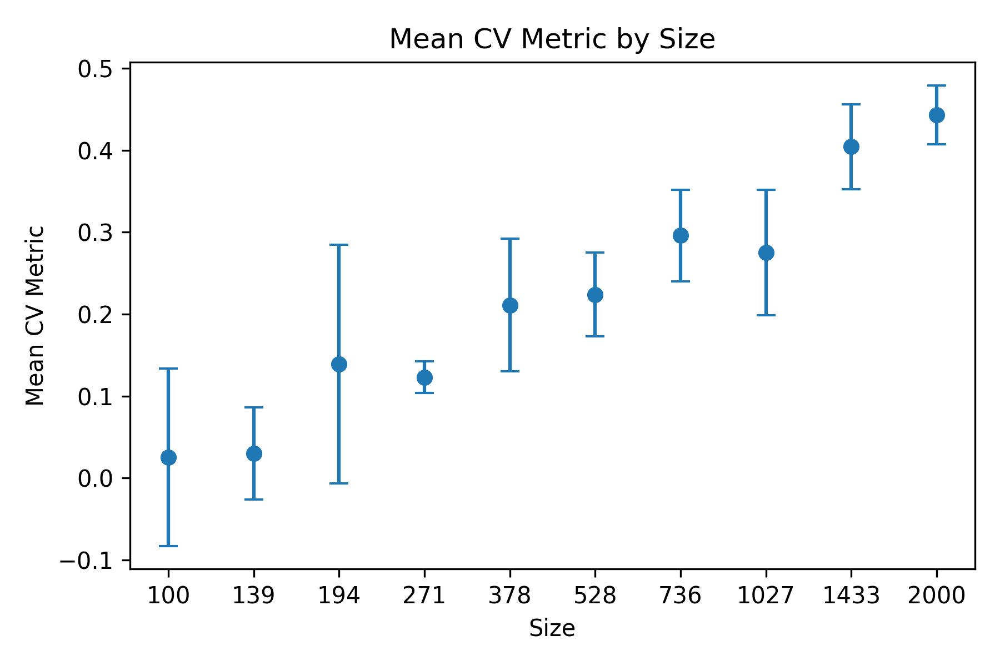

<p align="center">
  <i>A pipeline for simulating brain imaging data and associated phenotypes for power calculations.</i>
  <br/>
</p>


A power calculator for between subject associations of brain imaging and phenotypes (aka BWAS) developed by the Masonic Institute of the Developing Brain at the University of Minnesota. The pipeline is built using [Python](https://www.python.org/) and [bash](https://www.gnu.org/software/bash/), and is designed to run on HPC clusters with a SLURM scheduler.

---
<br />


## Overview

This pipeline estimates statistical power for BWAS analyses by asking: *given a dataset of a certain size, how well can functional connectivity predict a phenotype of interest?* Unlike approaches that use repsampling of existing datasets (e.g. Marek et al., 2024), this approach simulates functional connectivity matrices and is thus not bound by existing dataset size, sampling and data quality. It does this by:

1. **Generating a sample-size grid** — a logarithmically spaced set of 10 sample sizes from N=100 to N=2000, with each size representing the number of simulated individuals' brain images
2. **Simulating functional connectivity** — for each index, a covariance matrix is simulated by drawing a reference image `.pconn.nii` decomposing using eigendecomposition, and simulating a timeseries from the resulting eigenvalues
3. **Combining across replicates** — individual covariance matrices are vectorized and stacked into full arrays per sample size
4. **Cross-validating** — k-fold CV is run using a pluggable ML model (default: Random Forest) to predict phenotypes from FC features
5. **Aggregating and plotting** — per-fold R² metrics are averaged across folds and replicates per sample size, and a power curve is produced

The primary entry point is `PWR.sh`, which orchestrates all steps as a chain of dependent SLURM array jobs.

---
<br />

## Requirements

- HPC cluster with SLURM scheduler
- Python environment with Python 3 and required modules available in `env_setup.yml`. The easiest way to achieve this is using miniconda. See below example set up guide.

<br />

#### Python env set up with Miniconda
In 'reqs' folder use the env_setup.yml to create the environemnt which will be called 'BWAS_PWR_env':  
`conda env create -f (cloned_dir)/reqs/env_setup.yml`

Check env was installed correctly:  
`conda info --envs`

There should now be a `(your_miniconda_dir)/envs/BWAS_PWR_env` visible

To activate this environment:  
`conda activate HCP_env`

<br />

#### For internal use at the UMN MSI cluster users part of the faird group ONLY:
- Use the `FC_stability` conda env. Make sure you source the faird miniconda3 path first.


---
<br />

## Quick Start

Clone the repository and submit the pipeline from your working directory:

```bash
git clone https://github.com/your-org/power_calculator.git
cd power_calculator

sbatch PWR.sh \
  --pconnref  /path/to/reference.pconn.nii \
  --singletemp 0 \
  --numtemp    5 \
  --epsilon    1.0 \
  --condaenv   FC_stability
```

`--wrkdir`, `--pconndir`, and `--filedir` all default to `$PWD`. `--nrep` defaults to `10` and `--ntime` to `1000`. PCA preprocessing is off by default; add `--pca` to enable it.

A more complex example overriding all defaults and enabling PCA:

```bash
sbatch PWR.sh \
  --pconnref   /path/to/reference.pconn.nii \
  --singletemp 0 \
  --numtemp    5 \
  --epsilon    0.5 \
  --condaenv   FC_stability \
  --k-outer    10 \
  --n-outer    2 \
  --wrkdir     /scratch.global/myuser/pwr_output \
  --pconndir   /path/to/pconn_subjects \
  --filedir    /path/to/power_calculator \
  --nrep       50 \
  --ntime      2000 \
  --pca \
  --n-components 200
```

---
<br />

## Usage

```
sbatch PWR.sh [OPTIONS]
```

### Required Arguments

| Flag            | Description                                                                                                      |
|-----------------|------------------------------------------------------------------------------------------------------------------|
| `--pconnref`    | Path to the reference `.pconn.nii` file used for the dimensions or if a single template is invoked              |
| `--singletemp`  | `0` = simulate imaging data by drawing multiple pconn files to serve as templates, `1` = only use one pconn template for all simulated samples |
| `--numtemp`     | Number of pconn templates (subjects) to be averaged for use in the eigendecomposition                                            |
| `--epsilon`     | Noise scale for the phenotype: `yt = y + N(0, (epsilon * sd(y))^2)`; `0` = no noise (float >= 0)                 |
| `--condaenv`    | Conda environment activated by every step script                                                                 |

### Optional Arguments (with defaults)

| Flag          | Default  | Description                                                        |
|---------------|----------|--------------------------------------------------------------------|
| `--wrkdir`    | `$PWD`   | Working directory where all outputs will be written                |
| `--pconndir`  | `$PWD`   | Directory containing subject `.pconn.nii` files to be used as templates |
| `--filedir`   | `$PWD`   | Directory containing the pipeline scripts (e.g. `cv.sh`, `cv.py`) |
| `--nrep`      | `10`     | Number of simulation time series to be averaged for a given eigendecomposition |
| `--ntime`     | `1000`   | Number of timepoints to be simulated for the brain imaging data    |

### Pipeline Control (partial runs and epsilon sweeps)

| Flag           | Default | Description                                                                 |
|----------------|---------|-----------------------------------------------------------------------------|
| `--start-step` | `setup` | First step to run: `setup`, `simulate`, `combine`, `noise`, `cv`, `final`   |
| `--stop-step`  | `final` | Last step to run (same vocabulary)                                          |
| `--reuse-from` | none    | Reuse another run's combined matrices: symlinks its `full_<size>_{cov,cor,y}.npy` into this run's `pwr_data/` and implies `--start-step noise` |
| `--noise-seed` | unseeded | RNG seed for the noise step, making the phenotype draw reproducible        |

Required arguments are enforced only for the steps that actually run:
`--pconnref`, `--singletemp` and `--numtemp` are needed only when the simulate
step runs, and `--epsilon` only when the combine or noise step runs. A
CV-onwards rerun therefore needs neither.

### Model Selection

| Flag              | Default         | Description                                                              |
|-------------------|-----------------|--------------------------------------------------------------------------|
| `--model`         | `random_forest` | Machine-learning model to use for CV (see available models below)        |
| `--pca`           | off             | Enable PCA preprocessing before the model (flag, no value needed)        |
| `--n-components`  | `500`           | Number of PCA components; only used if `--pca` is set                    |
| `--n-estimators`  | `500`           | Number of trees (Random Forest / Gradient Boosting only)                 |

### Model Hyperparameters

| Flag               | Default   | Applies to        |
|--------------------|-----------|-------------------|
| `--ridge-alpha`    | `1.0`     | Ridge             |
| `--lasso-alpha`    | `0.01`    | Lasso             |
| `--en-alpha`       | `0.01`    | ElasticNet        |
| `--en-l1-ratio`    | `0.5`     | ElasticNet        |
| `--svr-c`          | `1.0`     | SVR               |
| `--nn-hidden`      | `256,128` | Neural Network    |
| `--nn-lr`          | `0.001`   | Neural Network    |
| `--gb-estimators`  | `300`     | Gradient Boosting |
| `--gb-lr`          | `0.05`    | Gradient Boosting |

---
<br />

## Worked Example

This example uses an ABCD Study participant pconn file as the reference and runs in multi-template mode with 5 CV folds and 20 time series repetitions.

### Submitting the job

```bash
sbatch /scratch.global/and02709/power_calculator/PWR.sh \
  --wrkdir     /scratch.global/and02709/p2 \
  --pconndir   /projects/standard/feczk001/shared/projects/ABCD/gordon_sets/data/group2_10minonly_FD0p1 \
  --pconnref   /projects/standard/feczk001/shared/projects/ABCD/gordon_sets/data/group2_10minonly_FD0p1/sub-NDARINV00J52GPG_ses-baselineYear1Arm1_task-rest_bold_roi-Gordon2014FreeSurferSubcortical_timeseries.ptseries.nii_5_minutes_of_data_at_FD_0.2.pconn.nii \
  --singletemp 0 \
  --numtemp    1 \
  --filedir    /scratch.global/and02709/power_calculator \
  --kfolds     5 \
  --nrep       20 \
  --ntime      2000 \
  --epsilon    1
```

To run the same example with PCA preprocessing enabled:

```bash
sbatch /scratch.global/and02709/power_calculator/PWR.sh \
  --wrkdir     /scratch.global/and02709/p2 \
  --pconndir   /projects/standard/feczk001/shared/projects/ABCD/gordon_sets/data/group2_10minonly_FD0p1 \
  --pconnref   /projects/standard/feczk001/shared/projects/ABCD/gordon_sets/data/group2_10minonly_FD0p1/sub-NDARINV00J52GPG_ses-baselineYear1Arm1_task-rest_bold_roi-Gordon2014FreeSurferSubcortical_timeseries.ptseries.nii_5_minutes_of_data_at_FD_0.2.pconn.nii \
  --singletemp 0 \
  --numtemp    1 \
  --filedir    /scratch.global/and02709/power_calculator \
  --kfolds     5 \
  --nrep       20 \
  --ntime      2000 \
  --epsilon    1 \
  --pca \
  --n-components 500
```
<br />

### What happens step by step

**Step 1 — Setup (`pwr_setup.sh`)**

`pwr_setup.py` generates the sample-size index grid and writes it to `pwr_data/pwr_index_file.txt`. The grid covers 10 logarithmically spaced sample sizes:

```
200, 286, 409, 585, 836, 1196, 1710, 2445, 3497, 5000
```

Each size N contributes N rows (one per simulated subject in a dataset of that size), yielding 16,164 total index rows. These are chunked into batches of 100 for array job submission (~162 array jobs).

The ladder is built with `np.logspace` from `SIZE_MIN` to `SIZE_MAX` in `N_SIZES` steps. All three can be overridden by environment variable, as can the ladder itself:

```bash
export SIZE_MIN=100 SIZE_MAX=2000 N_SIZES=10   # different log-spaced ladder
export SAMPLE_SIZES="100,200,400,800"          # or an explicit one
```

**Step 2 — Simulation array jobs (`pwr_sub_python.sh`)**

Each array job processes a chunk of 100 rows from the index file. For each row, `pwr_process_chunk_z.py` loads the reference pconn, draws `--ntime` timepoints (2000 in this example), and computes an empirical FC covariance matrix. With `--nrep 20`, each (size, index) combination is simulated via time series 20 times. Output files are written per subject:

```
pwr_data/dat_size_<N>_index_<i>_cov.npy
pwr_data/dat_size_<N>_index_<i>_meta.json
```

In single-template mode (`--singletemp 1`), `pwr_process_chunk_single_z.py` is used instead, simulating from a single fixed reference pconn with `--use_one_target`.

**Step 3 — Combine data (`combine_data.sh`)**

`combine_data.py` stacks all subject covariance `.npy` files for each sample size into a single combined matrix:

```
pwr_data/full_<N>_cov.npy
```

**Steps 4–5 — CV preparation (`cvGen.sh`, `setupCVmetrics.sh`)**

`cvGen.py` generates stratified k-fold train/test splits for each sample size and writes them as:

```
pwr_data/full_<N>_fold_<k>_split.npz
```

`setupCVmetrics.py` initializes the output metric structures. With 10 sample sizes and 5 folds, this produces 50 split files, one array task each.

**Step 6 — Cross-validation (`cv.sh`)**

An array job runs one task per split file. Each task loads the covariance matrix, applies StandardScaler (and optionally PCA if `--pca` was passed), trains the model on the training split, and evaluates on the test split. The primary metric is **R²** (coefficient of determination). Results are written as:

```
pwr_data/data_<N>_fold_<k>_cvr2.npy
```

**Step 7 — Final aggregation (`final_data.sh`)**

`final_data.py` reads all `_cvr2.npy` files, computes mean and standard deviation of R² across folds and replicates for each sample size, and writes:

- `metrics_data.pkl` — full per-fold R² table (DataFrame with columns: `file_list`, `size`, `fold`, `metrics`)
- `metrics_summary.pkl` — mean ± SD R² per sample size (columns: `size`, `mean_metric`, `sd_metric`)
- `mean_metric_by_size.png` — power curve plot
- `pconn_template_lookup.csv` — record of which pconn files were used per simulation index

<br />

### Expected output: Power Curve

The final plot (`mean_metric_by_size.png`) shows mean cross-validated R² as a function of sample size, with error bars representing ±1 SD across folds and replicates:



**How to read this plot:**

- The **x-axis** is sample size (N), ranging from 100 to 2000
- The **y-axis** is mean cross-validated R² — how well functional connectivity predicts the phenotype at that sample size
- Each **point** is the mean R² across all k folds × replicates; **error bars** are ±1 SD
- R² near **0** indicates the model performs at chance; higher values indicate better phenotype prediction
- The curve's shape reveals the **power-vs-sample-size relationship**: where it begins to plateau indicates diminishing returns from additional data

In the example above, R² rises from near zero at N=100 to ~0.44 at N=2000. The large error bars at small N (e.g. the lower bound reaching -0.1 at N=100) reflect high variance in small-sample estimates — the model sometimes performs below chance due to insufficient data to learn a reliable signal. The curve has not fully plateaued at N=2000, suggesting that even larger samples would continue to improve predictive performance for this phenotype/FC combination.

---
<br />

## Epsilon Sweeps — Simulate Once, Reuse Everywhere

Epsilon controls the noise added to the phenotype in Step 3:

```
y  = cor_mat @ ridge_vec                    # clean signal
yt = y + N(0, (epsilon * sd(y))^2)          # what cv.py fits
```

Nothing upstream of that depends on it. The simulated matrices, and the
`full_<size>_{cov,cor}.npy` files stacked from them, are identical for every
epsilon value — so running the whole pipeline once per epsilon repeats its
most expensive stage for no reason.

Instead, run Steps 1–3 once and reuse the result:

```bash
./run_epsilon_sweep.sh \
  --sweepdir /scratch.global/$USER/pwr_sweep \
  --pconndir /path/to/pconn/pool \
  --pconnref /path/to/reference.pconn.nii \
  --filedir  /path/to/power_calculator \
  --condaenv FC_stability \
  --eps-min 1 --eps-max 10 --eps-step 1
```

This submits:

1. **A base run** — `PWR.sh --stop-step combine`, writing
   `base/pwr_data/full_<size>_{cov,cor,y}.npy`. No CV, no aggregation.
2. **One run per epsilon** — `PWR.sh --reuse-from <base> --epsilon <e>`, queued
   behind the base run with `--dependency=afterok`. Each symlinks the base
   matrices, rewrites `full_<size>_yt.npy` for its own epsilon, then runs CV
   and aggregation as usual.

Every epsilon is evaluated on the *same* simulated subjects, so differences
between the resulting power curves reflect phenotype SNR rather than a fresh
draw of simulated brains. Add `--dry-run` to print the `sbatch` commands
without submitting, and `--base-ready DIR` to hang a new sweep off a base run
that already finished.

Once everything completes, combine the per-epsilon curves:

```bash
python3 collect_sweep.py /scratch.global/$USER/pwr_sweep
```

which writes `power_curves_by_epsilon.csv` (long format: epsilon, size,
mean_metric, sd_metric) and `power_curves_by_epsilon.png` (one curve per
epsilon on a shared axis). Pass `--no-errorbars` if ten sets of SD bars
overlap too heavily to read.

### Doing it by hand

The launcher is a convenience wrapper; the same thing works step by step:

```bash
# 1. Base run: Steps 1-3 only. --epsilon 0 is required by combine_data.py,
#    but the yt file it writes is discarded and rewritten per epsilon.
sbatch PWR.sh --wrkdir /path/to/base --pconndir /path/to/pconn \
              --pconnref myref --singletemp 0 --numtemp 1 \
              --filedir /path/to/scripts --condaenv FC_stability \
              --epsilon 0 --stop-step combine

# 2. One run per epsilon, reusing those matrices.
sbatch PWR.sh --wrkdir /path/to/sweep/eps_3 --filedir /path/to/scripts \
              --condaenv FC_stability --epsilon 3 \
              --reuse-from /path/to/base --noise-seed 123459
```

`--start-step`/`--stop-step` are useful outside sweeps too — for example,
`--start-step cv` reruns cross-validation with a different model on data that
is already combined, without touching the simulation.

### What reuse links, and what it does not

| File | Reused | Why |
|------|--------|-----|
| `full_<size>_cov.npy` | symlinked | Epsilon-independent |
| `full_<size>_cor.npy` | symlinked | Epsilon-independent; the feature matrix `cv.py` loads |
| `full_<size>_y.npy`   | symlinked | Clean phenotype, epsilon-independent |
| `pconn_template_lookup.csv` | symlinked | Provenance |
| `full_<size>_yt.npy`  | **written fresh** | The one file epsilon changes |

Symlinks rather than copies keep the sweep to one physical copy of the
simulated data, which matters when `full_5000_cor.npy` alone runs to several
gigabytes.

Note that `combine_data.py` deletes the per-subject
`dat_size_<N>_index_<k>_*` files once a size has been stacked, so the base run
cannot be re-combined later. The `full_*` matrices are the durable artifact —
keep the base directory for as long as the sweep might be extended.

---
<br />

## Pipeline Steps Reference

| Step | Script                                            | Description                                                             |
|------|---------------------------------------------------|-------------------------------------------------------------------------|
| 1    | `pwr_setup.sh` / `pwr_setup.py`                  | Generates `pwr_index_file.txt` with the (size, subject) index grid      |
| 2    | `pwr_sub_python.sh` / `pwr_sub_python_single.sh` | Array job: simulates FC covariance matrices from the reference pconn    |
| 3    | `combine_data.sh` / `combine_data.py`            | Stacks per-subject files into full matrices per sample size, computes `y` and the noisy `yt` |
| 3b   | `apply_epsilon.sh` / `apply_epsilon.py`          | Rewrites `yt` for a new epsilon from existing combined data; runs only when the invocation starts at `noise` |
| 4    | `cv.sh` / `cv.py`                                | Array job: runs all CV folds for one sample size per task               |
| 5    | `final_data.sh` / `final_data.py`                | Aggregates R² metrics, builds summary tables, and plots the power curve |

A `job_manifest.tsv` is written to `$WRKDIR/OUT/` recording the SLURM job ID, stdout path, and stderr path for every submitted step.

---
<br />

## Available ML Models

Models live in the `models/` directory. Each is a self-contained plugin implementing `CVModel` from `models/base.py`. All models support optional PCA preprocessing, controlled globally via the `--pca` flag in `PWR.sh`. PCA is **off by default** for all models.

| Model name          | Description                  |
|---------------------|------------------------------|
| `random_forest`     | Random Forest                |
| `ridge`             | Ridge Regression             |
| `lasso`             | Lasso Regression             |
| `elastic_net`       | ElasticNet                   |
| `svr`               | Support Vector Regression    |
| `neural_network`    | MLP Regressor                |
| `gradient_boosting` | Gradient Boosting            |

To run any model with PCA dimensionality reduction:

```bash
sbatch PWR.sh ... --model ridge --pca --n-components 200
```
<br />

### Adding a Custom Model

1. Copy `models/TEMPLATE.py` to `models/<your_model_name>.py`
2. Implement `cli_args()`, `__init__()`, `fit()`, and `predict()`
3. Decorate the class with `@register("<your_model_name>")`
4. Pass `--model <your_model_name>` to `PWR.sh`

The `--pca` flag is handled automatically by the base infrastructure — your model receives `args.pca` and `args.n_components` like all built-in models. No changes to `cv.py`, `cv.sh`, or `PWR.sh` are required.

---
<br />

## Output Structure

All outputs are written under `$WRKDIR/`:

```
$WRKDIR/
├── OUT/                                    # SLURM stdout logs + job_manifest.tsv
├── ERR/                                    # SLURM stderr logs
├── mean_metric_by_size.png                 # Final power curve plot
├── metrics_data.pkl                        # Per-fold R² for all sizes and folds
├── metrics_summary.pkl                     # Mean ± SD R² per sample size
├── pconn_template_lookup.csv               # Record of pconn files used per simulation
└── pwr_data/
    ├── pwr_index_file.txt                  # (size, subject) index grid (~8,506 rows)
    ├── dat_size_*_index_*_cov.npy          # Per-subject covariance matrices
    ├── dat_size_*_index_*_meta.json        # Simulation metadata (pconn paths, params)
    ├── full_*_cov.npy                      # Stacked covariance matrices per sample size
    ├── full_*_fold_*_split.npz             # CV train/test splits
    └── data_*_fold_*_cvr2.npy             # Per-fold R² metric files
```

---
<br />

## Repository Structure

```
power_calculator/
├── PWR.sh                         # Main orchestrator — submit this
├── pwr_setup.sh / .py             # Step 1: index grid generation
├── pwr_sub_python.sh              # Step 2: multi-temp worker dispatcher
├── pwr_sub_python_single.sh       # Step 2: single-temp worker dispatcher
├── pwr_process_chunk_z.py         # Core FC simulation (multi-temp)
├── pwr_process_chunk_single_z.py  # Core FC simulation (single-temp)
├── combine_data.sh / .py          # Step 3: aggregation, phenotype, noise
├── apply_epsilon.sh / .py         # Step 3b: rewrite yt for a new epsilon
├── cv.sh / .py                    # Step 4: cross-validation runner
├── final_data.sh / .py            # Step 5: aggregation and plotting
├── run_epsilon_sweep.sh           # Launcher: one base run + one run per epsilon
├── collect_sweep.py               # Combines per-epsilon curves into one figure
├── ridge_model_generation.py      # Standalone ridge weight utility
├── models/
│   ├── TEMPLATE.py                # Template for adding new models
│   ├── base.py                    # CVModel base class and plugin registry
│   ├── random_forest.py
│   ├── ridge.py
│   ├── lasso.py
│   ├── elastic_net.py
│   ├── svr.py
│   ├── neural_network.py
│   └── gradient_boosting.py
└── haufe.csv                      # Reference ridge weights (if used)
```

---
<br />

## License

[MIT licensed](LICENSE).


